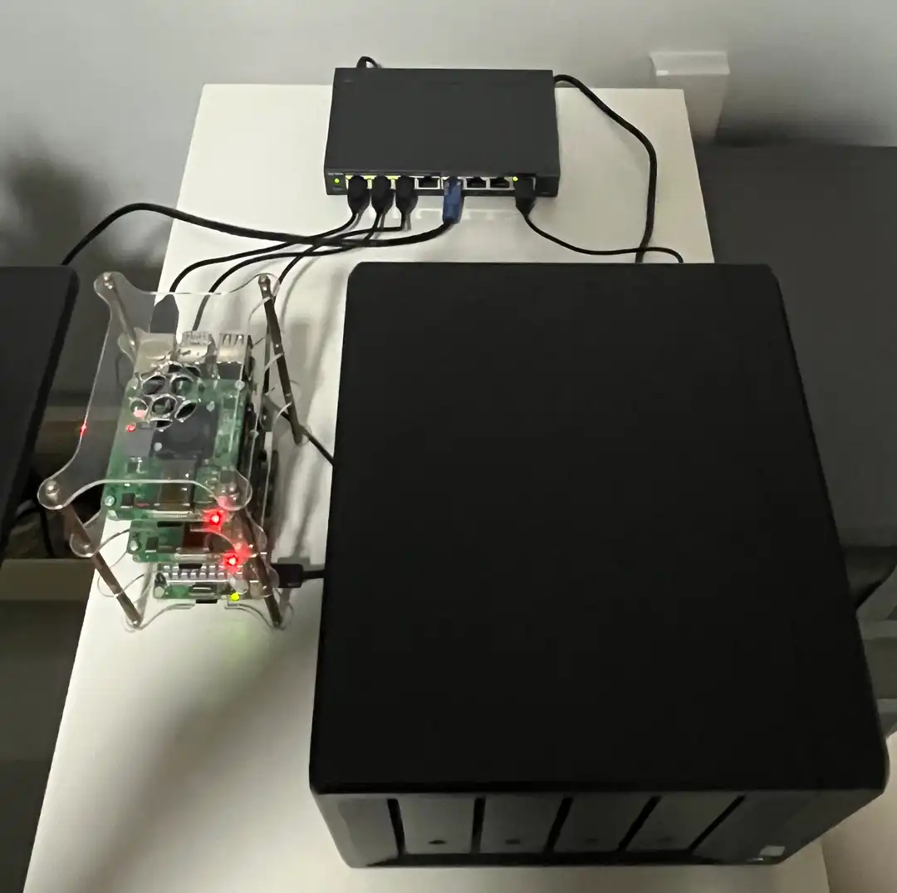
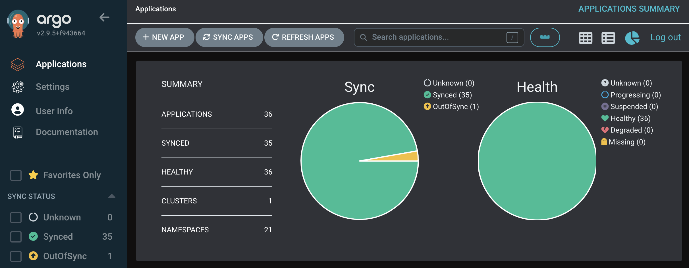

## Introduction

I have been running my homelab for more than half a year now and it seems like a good time to document my self-hosting journey thus far. This post will be the beginning of a multi-part series, covering the homelab at a high level before zooming in to greater details.

## Hardware

At the time of writing this post, my homelab includes:

- 2 Raspberry Pi 4 Model B (4GB) with PoE+ HAT
- 1 Raspberry Pi 5 (8GB)
- 1 Synology DS920+ NAS with 2 Seagate Ironwolf 4TB hard drives
- 1 TP-Link TL-SG108PE switch
- 1 Linksys E9450 router

The Pis provide the compute layer while the NAS provide the storage layer for the services I self-host.

## Software

Let's start with the operating system. All the Pis are running Raspberry Pi OS Lite (64-bit) which is a port of (Debian 12 Bookworm) while the NAS is running Synology's DSM 7.2.

For orchestration, all the Pis come together to form a Kubernetes (K8s) cluster with a single control plane node and two worker nodes. The K8s distribution I have went for was K3s, a lightweight distribution that packs all K8s components into a single binary. Just a few curl commands and a cluster is at your disposal.

In terms of deploying services into the cluster, I have decided to go with ArgoCD as my GitOps tool. I have deployed a grand total of 35 ArgoCD apps thus far, excluding one which serves as an app of apps.

Broadly speaking, the apps/services running in the cluster can be divided into two realistic categories:

- User-facing apps with actual utility

  - [Actual](https://github.com/actualbudget/actual): Personal finance app
  - [Authentik](https://github.com/goauthentik/authentik): Identity provider
  - [Jellyfin](https://github.com/jellyfin/jellyfin): Media system
  - [Jellyseerr](https://github.com/Fallenbagel/jellyseerr): Media request management system
  - [Vaultwarden](https://github.com/dani-garcia/vaultwarden): Bitwarden compatible server
  - [Synology Drive](https://www.synology.com/en-global/dsm/feature/drive): File management system\*
  - [Synology Photos](https://www.synology.com/en-global/dsm/feature/photos): Photo management system\*

  \* _Note: these apps are not running in the cluster (runs directly in the NAS instead) but traffic is proxied through a component in the cluster like all other apps_

- Components that may or may not be necessary
  - Networking components
    - [cert-manager](https://github.com/cert-manager/cert-manager): TLS certificates automation
    - [cloudflared](https://github.com/cloudflare/cloudflared): Cloudflare tunnel client (for exposing apps publicly)
    - [ExternalDNS](https://github.com/kubernetes-sigs/external-dns): DNS configuration automation (for Cloudflare and Pi-hole in my case)
    - [MetalLB](https://github.com/metallb/metallb): Load balancer implementation for bare-metal K8s clusters
    - [NGINX Ingress Controller](https://github.com/nginxinc/kubernetes-ingress): Ingress controller for NGINX (from F5)
    - [Pi-hole](https://github.com/pi-hole/pi-hole): DNS server for LAN
    - [Tailscale Operator](https://github.com/tailscale/tailscale): Manages Tailscale proxies (for exposing apps over VPN)
  - Observability components
    - [Grafana](https://github.com/grafana/grafana): Monitoring dashboards
    - [kube-state-metrics](https://github.com/kubernetes/kube-state-metrics): Exports metrics for cluster state
    - [Metrics Server](https://github.com/kubernetes-sigs/metrics-server): Container resource metrics for autoscaling
    - [Node Exporter](https://github.com/prometheus/node_exporter): Exports machine metrics
    - [Prometheus Operator](https://github.com/prometheus-operator/prometheus-operator): Manages Prometheus and related monitoring components
  - Storage components
    - [NFS CSI Driver](https://github.com/kubernetes-csi/csi-driver-nfs): Supports NFS StorageClass
    - [Synology CSI Driver](https://github.com/SynologyOpenSource/synology-csi): Supports iSCSI and SMB StorageClasses
  - Media components
    - [Prowlarr](https://github.com/Prowlarr/Prowlarr)
    - [Radarr](https://github.com/Radarr/Radarr)
    - [Readarr](https://github.com/Readarr/Readarr)
    - [Sonarr](https://github.com/Sonarr/Sonarr)
    - [Transmission](https://github.com/transmission/transmission)
  - Others
    - [ArgoCD](https://github.com/argoproj/argo-cd): GitOps continuous delivery tool
    - [MongoDB Community Operator](https://github.com/mongodb/mongodb-kubernetes-operator): Manages MongoDB community edition
    - [Sealed Secrets](https://github.com/bitnami-labs/sealed-secrets): Sealing secrets using asymmetric cryptography (so that they are safe to check into a git repo)

## Conclusion

This concludes the introductory post to my homelab. In the future, I plan to cover networking, storage, as well as some of the pitfalls I have ran into along the way. Stay tuned for more posts if you are interested in any of the above!
