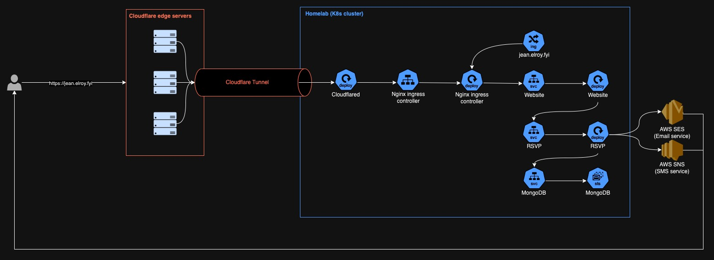

## Introduction

Landing page: https://jean.elroy.fyi

GitHub repo: https://github.com/elroy-haw/wedding

This project was created for my own wedding, featuring basic functionalities such as guest RSVP and a photo gallery. It marks my first attempt in full-stack development, going out of my comfort zone to experiment with frameworks which I haven't used before. Since I'm more accustomed to backend development, I began with designing the API and database (which, to be honest, weren't overly complex), before reluctantly delving into frontend work. Ultimately, I'd like to believe I managed a decent job as a beginner in frontend development, despite having a mental barrier against it (though there's certainly plenty of room for improvement).

## Architecture



When the guests visit the website, the domain `jean.elroy.fyi` resolves to a [Cloudflare tunnel](https://developers.cloudflare.com/cloudflare-one/connections/connect-networks/) domain which I have created. At the end of the tunnel is an instance of `cloudflared` which I run in my cluster. Based on the rules I have set up in `cloudflared`, traffic is forwarded accordingly to my public-facing NGINX ingress controller, which is responsible for routing to different public-facing websites/services running in my cluster. As shown in the diagram above, only the website is exposed publicly, while the RSVP service and MongoDB database can only be connected internally within the cluster. The RSVP service then leverages AWS [SES](https://docs.aws.amazon.com/ses/latest/dg/send-email.html) and [SNS](https://docs.aws.amazon.com/sns/latest/dg/sns-mobile-phone-number-as-subscriber.html) to send OTPs via email/text messages.

- Frontend

  - Written in TypeScript
  - Used NextJS + Tailwind CSS

- Backend

  - Written in Go
  - Used Gin web framework

- Database

  - Used MongoDB for storing guests and short-lived OTPs, tokens

- External dependencies

  - Used Cloudflare for tunneling, caching, and R2 object storage
  - Used AWS SES and SNS for sending OTPs via email/text messages

- Deployment

  - Code stored in GitHub, image built using Docker GitHub actions and stored in GitHub container registry
  - Frontend, backend, database, and Cloudflare tunnel runs in my homelab (K3s cluster)

## Learnings

### NextJS image optimizations

NextJS provides an `Image` component which features automatic [image optimizations](https://nextjs.org/docs/app/building-your-application/optimizing/images) e.g. automatically serving correctly sized images for different device sizes, using modern image format like WebP. This is convenient as developers no longer have to worry about unintentionally serving overly large images to small devices which significantly improves load time.

In production builds, [`sharp`](https://sharp.pixelplumbing.com/) is used to [optimize the images](https://github.com/vercel/next.js/blob/fff9ddc204ae58d3d0421cd4fb95e34c493a7047/packages/next/src/server/image-optimizer.ts#L415) on the fly. Here's the catch if you are running on your own hardware (like my Raspberry Pis with 4 cores each). These image optimization tasks are CPU intensive. Even with caching at different layers (e.g. Cloudflare CDN, NextJS image cache), `sharp` performing the optimizations for different device sizes (who knows how many there might be out there in this day and age) causes CPU throttling to happen each time a few users access the website and load the images (if they weren't cached). This problem is worsened by the large number of images I wanted to share in my wedding photo gallery section!

Therefore, I dropped the `Image` component provided by NextJS and ended up using the native HTML [responsive image feature](https://developer.mozilla.org/en-US/docs/Learn/HTML/Multimedia_and_embedding/Responsive_images) directly. I wrote a script which uses `sharp` to resize and compress my original JPEG images, for a pre-defined list of dimensions:

```javascript
const sharp = require("sharp");
const fs = require("fs");

const dimensions = [256, 384, 640, 750, 828, 1080, 1200, 1920, 2048, 3840];

const PUBLIC_DIR = "public";

fs.readdir(PUBLIC_DIR, (err, dirs) => {
  dirs.forEach((dir) => {
    fs.readdir(`${PUBLIC_DIR}/${dir}`, (err, files) => {
      files.forEach((file) => {
        const [name, ext] = file.split(".");
        dimensions.forEach((dim) => {
          if (ext === "jpg") {
            console.log(
              `generating ${PUBLIC_DIR}/${dir}/${name}-${dim}.webp...`,
            );
            sharp(`${PUBLIC_DIR}/${dir}/${file}`)
              .rotate()
              .resize(dim)
              .webp({ quality: 50 })
              .toFile(`${PUBLIC_DIR}/${dir}/${name}-${dim}.webp`);
          }
        });
      });
    });
  });
});
```

And another script to upload to Cloudflare R2 object storage:

```bash
#!/bin/bash

r2_bucket_path="public-assets/wedding"
public_dir="public"

dirs=($(ls $public_dir))

for dir in ${dirs[@]}; do
    images=($(ls $public_dir/$dir | grep webp ))
    for image in ${images[@]}; do
        echo "uploading from $public_dir/$dir/$image to $r2_bucket_path/$dir/$image..."
        npx wrangler r2 object put $r2_bucket_path/$dir/$image --cache-control="max-age=31536000" --file=$public_dir/$dir/$image
    done
done
```

This change significantly improved my website's loading time (image loading was a severe bottleneck as revealed by [Lighthouse](https://developer.chrome.com/docs/lighthouse/overview)).
